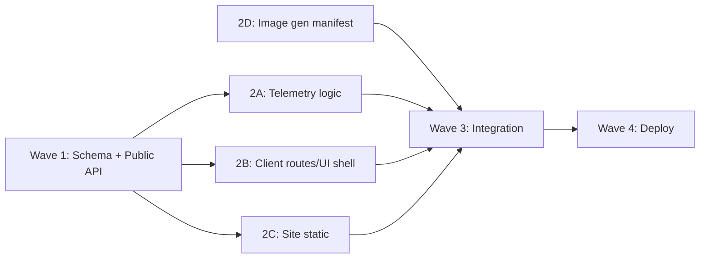

# Архитектура: viwa-landing-subscriptions

**sessionId:** `viwa-landing-subscriptions`  
**Дата:** 2026-07-29  
**Статус:** architect v1.2 (review round 2)  
**Вход:** `tz.md` v1, `architecture_review.md` круг 1  
**Репозитории:** `viwa-telemetry`, `viwa-client-web-app`, `viwa-site`

---

## Обзор

Multi-repo фича: editorial landing (concept-16) на `vitamin-water.ru`, обновлённый клиентский кабинет на `cabinet.vitamin-water.ru`, backend-контракты в `viwa-telemetry` (`tl.vitamin-water.ru/api/v1`).

**Ключевые архитектурные принципы:**

| # | Решение |
|---|---------|
| 1 | Месячные пакеты 12 L / 18 L — rename + migration Prisma, monthly pool вместо MSK daily reset |
| 2 | Public tiers (+ tastes): **только marketing-visible 12/18 L**; legacy grandfather rows исключены фильтром модели |
| 3 | `registrationSource` — first-class enum, **вычисляется только на сервере**; existing attribution immutable |
| 4 | Serial обязателен для **первичной** регистрации; returning — без serial; landing CTA без serial → **Serial Capture** (не блокирующий тупик) |
| 5 | Подписка network-wide (as-is); любимые вкусы — до 3 из canonical 14 |
| 6 | Split landing: static site + **deep-link / mock preview** (iframe не primary) |
| 7 | Image assets — manifest от parent-агента; developer подключает по контракту |
| 8 | Deploy: telemetry → client → site; paths confirmed (`wiva-server`, docroots §8); smoke + rollback без Docker |
| 9 | Локальные uncommitted analytics UI changes в telemetry — **не откатывать**, работать вокруг |
| 10 | Touchpoints + волны параллельной разработки — см. §10 |

---

## Компоненты и ответственность

### viwa-telemetry (backend + admin dashboard)

| Комponent | Ответственность | Путь (ориентир) |
|-----------|-----------------|-----------------|
| **Prisma schema + migrations** | `monthlyVolumeMl`, `registrationSource`, `ClientFavoriteTaste`; data migration tiers 12/18 L | `apps/api/prisma/` |
| **LoyaltyDomainService** | Monthly pool debit; **`ensureDailyReset` только legacy**; pool reset **только** subscription ops | `apps/api/src/loyalty/loyalty-domain.service.ts` |
| **PublicSubscriptionController** (new) | `GET /public/subscription-levels` (marketing filter), `GET /public/tastes` | `apps/api/src/loyalty/public-api/` |
| **CORS config** (new) | Browser GET/OPTIONS для `/api/v1/public/*` с `vitamin-water.ru`, `cabinet.vitamin-water.ru` | `apps/api/src/main.ts` (+ optional nginx snippet) |
| **ClientAuthService** | Server-side `registrationSource` derivation; new-client serial gate | `apps/api/src/client-auth/client-auth.service.ts` |
| **ClientProfileController + mapper** | Monthly fields in profile; favorite tastes CRUD | `apps/api/src/loyalty/client-api/` |
| **SubscriptionLevelService + admin** | Admin CRUD tiers 12000/18000 ml; archive legacy tiers | `apps/api/src/loyalty/subscription-level.service.ts` |
| **Admin analytics** | Filter/breakdown by `registrationSource`; registration machine ranking сохраняется | `apps/api/src/loyalty/admin-api/admin-analytics.service.ts` |
| **Admin client card** | Display `registrationSource` + optional machine serial | `apps/api/src/loyalty/admin-api/admin-clients.service.ts` |
| **BillingService** | SBP init unchanged; `applySubscription` resets monthly pool | `apps/api/src/billing/billing.service.ts` |
| **Machine WS handler** | Profile push with monthly fields (deprecated daily alias one release) | `apps/api/src/loyalty/machine-ws/` |
| **Contracts + tests** | loyalty-*-rest.md, client-api.spec, loyalty-domain.service.spec | `docs/contracts/`, `apps/api/test/` |
| **Dashboard web (analytics UI)** | Uncommitted local changes — **preserve**; add registrationSource filter in separate PR slice if needed | `apps/web/src/` |

### viwa-client-web-app (React SPA)

| Component | Ответственность | Путь (ориентир) |
|-----------|-----------------|-----------------|
| **Router** | `/register` (serial capture), `/auth` (returning), `/m/:serial/*` (first-time), `/home` (post-auth clean URL) | `src/pages/App.tsx` |
| **SerialCapturePage** (new) | Manual serial input + public validation; redirect to `/m/{serial}/auth` | `src/pages/SerialCapturePage/` |
| **ValidationPage** | Machine lookup; entry routing | `src/pages/ValidationPage/` |
| **Auth flow** | Pass `registrationHint` (not authoritative enum); strip serial after first reg | `src/state/auth/`, `AuthPage`, `SmsPage` |
| **SubscriptionPage redesign** | concept-16 UI: progress (monthly), QR, flavors, plan | `src/pages/SubscriptionPage/` |
| **FavoriteFlavorsSection** (new) | Pick up to 3 from 14 keys | `src/components/` |
| **API modules** | public tiers/tastes; favorite tastes PATCH | `src/app/api/modules/` |
| **Design tokens** | Shared CSS variables aligned with site (`--viwa-accent: #7F5AF0`) | `src/styles/viwa-tokens.css` |
| **Landing integration** | Deep-link builder; sessionStorage `viwa_entry`, `viwa_serial` | `src/utils/landingEntry.ts` |

### viwa-site (static)

| Component | Ответственность | Путь (ориентир) |
|-----------|-----------------|-----------------|
| **index.html** (replace/extend) | Single-page concept-16 landing: hero, 14 flavors, 2 tiers, CTA | `index.html` |
| **css/viwa-landing.css** | Split layout desktop; stack mobile; shared tokens | `css/` |
| **js/landing-api.js** | Fetch public tiers/tastes; skeleton/error states | `js/` |
| **js/landing-cta.js** | Build cabinet URLs (`entry=website`, serial preservation) | `js/` |
| **assets/generated/** | Parent-generated images per manifest | `assets/generated/` |
| **assets/manifest.json** | Asset contract (see §7) | `assets/manifest.json` |

**Desktop split (concept-16):** левая колонка — static marketing; правая — **static high-fidelity mock** (PNG/WebP preview кабинета) + кнопка «Открыть кабинет» → same-tab deep-link на `cabinet.vitamin-water.ru`. **Iframe не используется** как primary path (cookies third-party, CSP, postMessage complexity).

---

## Интерфейсы и контракты

### 0. Единый cross-repo контракт attribution (канон)

> **TZ drift fix:** в `tz.md` v1 встречаются `source=website` (query) и `registrationSource=website` (body). **Канон v1.2** — таблица ниже. Planner обновляет `loyalty-client-rest.md` / `loyalty-public-rest.md`; `tz.md` ссылается на architecture §0 (не менять продуктовый код в этом шаге).

| Слой | Имя | Значения | Кто пишет | Кто читает |
|------|-----|----------|-----------|------------|
| Landing URL query | **`entry`** | `website` | site `landing-cta.js` | client `landingEntry.ts` |
| Cabinet URL query | **`entry`** | `website` | site, deep links | client router/auth |
| Cabinet URL query | **`serial`** | `VIWA-XXXXXX` | site (from QR/query) | client SerialCapture |
| sessionStorage | **`viwa_entry`** | `website` | client on mount | client check-code builder |
| sessionStorage | **`viwa_serial`** | serial string | site→client handoff | client register flow |
| check-code body | **`registrationHint`** | `website` \| `machine_qr` | client SPA | telemetry (hint only) |
| DB / API response | **`registrationSource`** | `WEBSITE` \| `MACHINE_QR` \| `UNKNOWN` | **server only** | admin, profile |

**Запрещено в client/site payload:** `registrationSource` в request body (не доверять клиенту).

**Mapping (legacy TZ → canon):**

| TZ v1 (устар.) | Canon v1.2 |
|----------------|------------|
| `?source=website` | `?entry=website` |
| `?from=website` | `?entry=website` |
| body `registrationSource=website` | body `registrationHint=website` |

**Landing → cabinet URL builder (canon):**

```
cabinet.vitamin-water.ru/register?serial={serial}&entry=website
cabinet.vitamin-water.ru/register?entry=website
cabinet.vitamin-water.ru/auth
vitamin-water.ru/?serial={serial}&entry=website   # QR on station
```

---

### 1. Public API (viwa-telemetry)

#### Marketing tier filter (model contract)

Public и client **purchase/marketing** endpoints возвращают **только** tiers, проходящие фильтр:

```sql
WHERE is_archived = false
  AND is_marketing_visible = true
  AND is_legacy_daily_semantics = false
  AND monthly_volume_ml IN (12000, 18000)
ORDER BY sort_order, name
```

| Field | Type | Purpose |
|-------|------|---------|
| `isLegacyDailySemantics` | `Boolean` | `true` — grandfather daily MSK reset path; **never** in public API |
| `isMarketingVisible` | `Boolean` | `true` — ровно для 2 tiers 12 L / 18 L; public/client purchase UI |

**Invariant:** `GET /public/subscription-levels` **всегда** возвращает `items.length === 2` на production seed (после migration). Legacy rows с active subs остаются `isMarketingVisible=false`.

**Service method (canon):** `SubscriptionLevelService.listMarketingSubscriptionLevels()` — единый query для public + client tier picker.

#### CORS (обязательно до Wave 2C wire-up)

**Primary:** Nest/Fastify в `apps/api/src/main.ts`:

| Setting | Value |
|---------|-------|
| Paths | `/api/v1/public/*` |
| Methods | `GET`, `OPTIONS` |
| Origins (allowlist) | `https://vitamin-water.ru`, `https://www.vitamin-water.ru`, `https://cabinet.vitamin-water.ru` |
| Headers | `Content-Type` (default) |

**Fallback (ops):** nginx `add_header Access-Control-Allow-Origin` только для `/api/v1/public/` — если API-level CORS недоступен в релизе.

**Preflight:** `OPTIONS` → 204 с matching Allow-Origin.

#### `GET /api/v1/public/subscription-levels`

**Auth:** none. **Rate limit:** 60 req/min/IP (public family). **Cache:** `Cache-Control: public, max-age=300, stale-while-revalidate=60`.

**Response 200:**

```json
{
  "items": [
    {
      "id": "uuid",
      "name": "12 литров",
      "monthlyVolumeMl": 12000,
      "priceKopecks": 49900,
      "sortOrder": 1
    },
    {
      "id": "uuid",
      "name": "18 литров",
      "monthlyVolumeMl": 18000,
      "priceKopecks": 69900,
      "sortOrder": 2
    }
  ],
  "schemaVersion": 2
}
```

- **Без** legacy tiers в `items`, даже если `isArchived=false`.
- **Без** deprecated `dailyVolumeMl` в public response (только monthly); kiosk/WS alias — отдельный authenticated/WS path one release.
- Assert in tests: `items.every(t => [12000, 18000].includes(t.monthlyVolumeMl))`.

#### `GET /api/v1/public/tastes` (recommended)

**Auth:** none. **Rate limit:** 60 req/min/IP. **Cache:** `max-age=3600`.

**Response 200:**

```json
{
  "items": [
    {
      "mediaKey": "cherry",
      "nameRu": "Чёрная вишня",
      "sortOrder": 0,
      "imageUrl": "/assets/tastes/cherry.webp"
    }
  ],
  "schemaVersion": 1
}
```

- `mediaKey` — из `TASTE_MEDIA_KEYS` (`apps/api/src/products/taste-media-keys.ts`).
- `imageUrl` — optional CDN/static path; landing may override with generated assets from manifest.
- Source of truth для labels: `TASTE_MEDIA_KEY_LABELS_RU` (DRY — re-export in public service, не дублировать в site/client JSON).

#### Existing: `GET /api/v1/public/machines/by-serial/:serial`

Без изменений контракта. Используется site (optional prefetch), client validation, SerialCapturePage.

---

### 2. Client auth — `POST /api/v1/client/auth/check-code`

**Body (extended):**

```json
{
  "phone": "+79001234567",
  "code": "1234",
  "machineSerial": "VIWA-000004",
  "registrationHint": "website"
}
```

| Field | Notes |
|-------|-------|
| `machineSerial` | Required for **new** client creation (400 `SERIAL_REQUIRED` if absent) |
| `registrationHint` | Optional client hint: `"website"` \| `"machine_qr"`. **Не authoritative** — сервер игнорирует произвольные значения вне allowlist |

**Server-side `registrationSource` derivation (new client only):**

```
function deriveRegistrationSource(req, dto, isNewClient): RegistrationSource {
  if (!isNewClient) return existing.registrationSource; // immutable

  const hint = normalizeHint(dto.registrationHint); // allowlist only
  const referer = req.headers.referer ?? '';
  const origin = req.headers.origin ?? '';
  const fromWebsite = isAllowedMarketingOrigin(referer || origin);
  // Allowed: https://vitamin-water.ru, https://www.vitamin-water.ru,
  //          https://cabinet.vitamin-water.ru (entry from landing redirect)

  if (hint === 'website' && fromWebsite) return WEBSITE;
  if (dto.machineSerial && fromWebsite) return WEBSITE;
  if (dto.machineSerial && hint === 'machine_qr') return MACHINE_QR;
  if (dto.machineSerial) return MACHINE_QR;
  return UNKNOWN;
}
```

- `registrationHint` — единственное client-writable поле attribution (allowlist `website` | `machine_qr`).
- **`registrationSource` в response only** — см. §0.
- **Existing client:** `registrationSource` и `registrationMachineId` **не изменяются**; `machineSerial` в body игнорируется (as-is).

**New client errors:**

| Code | When |
|------|------|
| `SERIAL_REQUIRED` | New client, no `machineSerial` |
| `MACHINE_NOT_FOUND` | Invalid serial |
| `INVALID_CODE` | OTP invalid |

---

### 3. Client profile — monthly semantics

#### `GET /api/v1/client/me` (extended)

```json
{
  "id": "uuid",
  "phone": "+79001234567",
  "volumeMl": 450,
  "monthlyLimitMl": 12000,
  "monthlyUsedMl": 3500,
  "monthlyRemainingMl": 8500,
  "tierName": "12 литров",
  "subscriptionEndsAt": "2026-08-27T00:00:00.000Z",
  "limitExhausted": false,
  "poolExpiresAt": "2026-08-27T00:00:00.000Z",
  "favoriteTasteKeys": ["cherry", "lime-mint", "watermelon"],
  "registrationSource": "WEBSITE",
  "dailyLimitMl": 12000,
  "dailyUsedMl": 3500,
  "dailyRemainingMl": 8500,
  "limitResetsAt": null,
  "qrPayload": "CLIENT_uuid"
}
```

- `daily*` fields — deprecated alias (one release).
- `limitResetsAt` — **null** для monthly (pool expires at `subscriptionEndsAt` / `poolExpiresAt`).
- Trial (no subscription): `monthlyLimitMl=0`; progress ring uses `volumeMl` / `LOYALTY_TRIAL_VOLUME_ML`.

#### `PUT /api/v1/client/me/favorite-tastes`

```json
{ "tasteMediaKeys": ["cherry", "lime-mint"] }
```

- Max **3** keys; each must be in `TASTE_MEDIA_KEYS`; 400 `INVALID_TASTE` otherwise.

#### `GET /api/v1/client/subscription-levels`

**Purchase/marketing UI:** тот же фильтр, что public — `listMarketingSubscriptionLevels()`. Legacy grandfather tiers **не** показываются в tier picker (клиент на legacy sub видит текущий tier в profile, не в picker).

Admin CRUD `/admin/subscription-levels` — все tiers без marketing filter.

---

### 4. Client web routing contract

| Route | Purpose | Serial |
|-------|---------|--------|
| `/register?serial=VIWA-XXX&entry=website` | Entry from landing **with** serial | Optional query → auto-skip capture |
| `/register?entry=website` | Serial Capture | User provides serial |
| `/m/:machineSerial/auth` | First-time OTP | Required in path |
| `/m/:machineSerial/auth/sms/:time/:phone` | OTP entry | Required in path |
| `/auth` | Returning login | **None** |
| `/auth/sms/:time/:phone` | Returning OTP | **None** |
| `/home` | Post-auth subscription home | **None** (clean URL) |

**Post-first-registration URL strip:**

1. Success on `/m/{serial}/auth/sms/...` → `history.replaceState` + navigate to `/home`.
2. Persist `viwa_entry` / `viwa_serial` from query; clear serial from address bar after success.

**Landing → client URL builder:** см. §0 (canon `entry=website`).

---

### 5. Admin analytics contract (extension)

**Client list / card:** display `registrationSource` (`Website` | `Machine QR` | `Unknown`).

**`GET /admin/analytics/clients`:** add breakdown dimension:

```json
{
  "registrationSourceBreakdown": [
    { "source": "WEBSITE", "count": 42 },
    { "source": "MACHINE_QR", "count": 128 },
    { "source": "UNKNOWN", "count": 3 }
  ]
}
```

Update `docs/contracts/analytics-admin-rest.md` and `loyalty-admin-rest.md`.

**Uncommitted analytics UI:** developers continue on existing branch/worktree; add `registrationSource` widgets in Wave 3 without reverting chart refactors (+1751/−454 lines in `apps/web/`).

---

## Модели данных

### Prisma migration plan (viwa-telemetry)

**Migration name:** `20260729_monthly_subscription_and_registration_source`

#### Enum `RegistrationSource`

```prisma
enum RegistrationSource {
  WEBSITE
  MACHINE_QR
  UNKNOWN
}
```

#### `Client` changes

| Column | Action |
|--------|--------|
| `registration_source` | ADD, default `UNKNOWN` |
| `daily_used_ml` | RENAME → `monthly_used_ml` |
| `daily_usage_date` | DROP (no longer needed) |
| `favorite_tastes` | NEW relation → `ClientFavoriteTaste[]` |

#### `SubscriptionLevel` changes

| Column | Action |
|--------|--------|
| `daily_volume_ml` | RENAME → `monthly_volume_ml` |
| `is_legacy_daily_semantics` | ADD `Boolean @default(false)` |
| `is_marketing_visible` | ADD `Boolean @default(false)` |

**Seed (data migration):** existing tiers → `isLegacyDailySemantics=true`, `isMarketingVisible=false`. New rows:

| name | monthly_volume_ml | isLegacyDailySemantics | isMarketingVisible |
|------|-------------------|------------------------|-------------------|
| 12 литров | 12000 | false | **true** |
| 18 литров | 18000 | false | **true** |

#### New model `ClientFavoriteTaste`

```prisma
model ClientFavoriteTaste {
  id            String @id @default(uuid())
  clientId      String @map("client_id")
  tasteMediaKey String @map("taste_media_key")
  sortOrder     Int    @default(0) @map("sort_order")
  client        Client @relation(fields: [clientId], references: [id], onDelete: Cascade)

  @@unique([clientId, tasteMediaKey])
  @@index([clientId])
  @@map("client_favorite_tastes")
}
```

#### Data migration (same migration SQL step)

1. **Backfill `registration_source`:**
   - Clients with `registration_machine_id IS NOT NULL` → `MACHINE_QR`
   - Others → `UNKNOWN`
   - (No historical WEBSITE — field did not exist)

2. **Tiers:**
   - Existing tiers: `isLegacyDailySemantics=true`, `isMarketingVisible=false`; **не архивировать**, если на tier есть active subs (`subscription_ends_at > now()`).
   - Insert 2 marketing tiers (таблица выше).
   - **Prices:** admin-editable post-deploy.

3. **Existing active subscribers (grandfather until renewal):**
   - `subscription_level_id` остаётся на legacy row.
   - Pour/read path: **`ensureDailyReset` active** (legacy only).
   - On **renewal** payment → atomic transaction (см. § Monthly invariants).

**`daily_usage_date`:** DROP только в **шаге 4** migration order (после deploy gated code).

---

### Migration order (strict)

| Step | Action | Gate before next |
|------|--------|------------------|
| **M1** | PG dump (pre-migration) | backup verified |
| **M2** | ADD columns: `registration_source`, `is_legacy_daily_semantics`, `is_marketing_visible`, `client_favorite_tastes`; RENAME volume/usage columns | migration SQL applies |
| **M3** | Backfill tiers + `registration_source` on clients | exactly 2 rows `is_marketing_visible=true` |
| **M4** | Deploy API with **gated** `ensureDailyReset` + marketing filter + CORS | unit/integration green |
| **M5** | DROP `daily_usage_date` | no code path reads column |
| **M6** | Deploy client + site | E2E B-1…B-18 |

**Rollback between M2–M5:** symlink API revert; PG restore if M5 applied; forward-fix preferred over down-migration if M5 not applied.

---

### Monthly pool invariants (legacy vs monthly)

> Закрывает review #2: исключить двойной MSK reset/debit при rename `dailyUsedMl` → `monthlyUsedMl`.

#### Gate: `ensureDailyReset(client)`

```typescript
function ensureDailyReset(client: ClientWithTier, now: Date): ClientWithTier {
  const tier = client.subscriptionLevel;
  if (!tier?.isLegacyDailySemantics) {
    return client; // NO-OP for monthly marketing tiers
  }
  // existing MSK calendar-day reset on dailyUsageDate / monthlyUsedMl legacy path
}
```

**Вызывается из:** `getClientStatus`, `recordSubscriptionPour` — но **no-op** для monthly tier clients.

#### Единственные точки изменения monthly pool

| Operation | Allowed mutations |
|-----------|-------------------|
| **`applySubscription`** (payment PAID) | Atomic TX: `{ subscriptionLevelId, subscriptionEndsAt, monthlyUsedMl: 0 }` + history |
| **`recordSubscriptionPour`** (monthly tier) | `monthlyUsedMl += pourVolume`; **no** midnight reset |
| **Renewal migration** (legacy→marketing on pay) | Same as `applySubscription` — switch tier id + `monthlyUsedMl: 0` in one TX |
| **Subscription expiry** | `monthlyLimitMl` effectively 0; no reset |

**Forbidden for monthly tiers:**

- MSK midnight reset of `monthlyUsedMl`
- Reset pool outside `applySubscription` / renewal TX
- Debit without checking `monthlyRemainingMl >= pourVolume`

#### Legacy grandfather path (until renewal)

- `isLegacyDailySemantics=true` → preserve as-is MSK `ensureDailyReset` behavior on `monthly_used_ml` column (semantic: daily cap until renewal).
- Profile for legacy sub may still expose deprecated `daily*` alias one release.

#### Monthly pool semantics (marketing tiers)

| Event | Behavior |
|-------|----------|
| `applySubscription` | **Single TX:** set tier, `subscriptionEndsAt`, **`monthlyUsedMl=0`** |
| `recordSubscriptionPour` | Monthly tier: debit `monthlyUsedMl`; **skip** `ensureDailyReset` |
| Subscription expired | `monthlyLimitMl=0`; trial `volumeMl` unchanged |
| Mid-cycle tier change | No proration MVP: new tier on next `applySubscription` |

---

### Test invariants (must-pass before Wave 3)

| ID | Invariant | Test home |
|----|-----------|-----------|
| **T1** | `listMarketingSubscriptionLevels()` returns exactly **2** items | `subscription-level.service.spec.ts` |
| **T2** | Legacy tier with `isMarketingVisible=false` **absent** from public response even if `isArchived=false` | `client-api.spec.ts` / public e2e |
| **T3** | `monthlyVolumeMl` ∈ `{12000, 18000}` for all marketing tiers | seed + public API assert |
| **T4** | Monthly client: `ensureDailyReset` across MSK midnight → **`monthlyUsedMl` unchanged** | `loyalty-domain.service.spec.ts` (mock TZ) |
| **T5** | Legacy client: MSK midnight → usage reset (regression) | `loyalty-domain.service.spec.ts` |
| **T6** | `applySubscription` atomically sets `monthlyUsedMl=0` | `loyalty-domain.service.spec.ts` |
| **T7** | Pour on monthly sub debits pool once; no double debit on replay | `client-api.spec.ts` / pour idempotency |
| **T8** | CORS preflight `OPTIONS` from `Origin: https://vitamin-water.ru` → 204 + Allow-Origin | integration / manual smoke |
| **T9** | `registrationHint=website` + allowed Origin → `registrationSource=WEBSITE` | `client-auth` matrix spec |
| **T10** | Existing client + `machineSerial` in body → attribution **unchanged** | `client-api.spec.ts` |
| **T11** | New client without serial → `400 SERIAL_REQUIRED` | `client-api.spec.ts` |

**Wave 1 gate:** T1–T3 + T8 on staging before 2B/2C wire-up to live public API.

#### Rollback plan

1. **Before deploy:** PostgreSQL dump (per `docs/deployment/server.md`).
2. **Migration rollback SQL** (manual, in migration folder `down.sql`):
   - Rename columns back; drop `registration_source`, `client_favorite_tastes`; restore `daily_usage_date` with NULL.
3. **API rollback:** symlink `/opt/viwa-telemetry/current` → previous release.
4. **Feature flag:** `FEATURE_MONTHLY_POOL=false` forces legacy daily path without schema rollback (if columns renamed — prefer forward-fix).
5. **Client/site rollback:** redeploy previous static/build artifacts.

---

## Интеграции и потоки

### Flow A: Landing with QR serial

```
QR on machine → vitamin-water.ru/?serial=VIWA-000004&entry=website
  → landing stores viwa_serial in sessionStorage
  → user clicks CTA
  → cabinet/register?serial=VIWA-000004&entry=website
  → skip capture → /m/VIWA-000004/auth
  → OTP → check-code(machineSerial, registrationHint=website)
  → server: registrationSource=WEBSITE, registrationMachineId=machine
  → redirect /home (serial stripped)
```

### Flow B: Landing without serial (honest path)

```
vitamin-water.ru → CTA «Регистрация»
  → cabinet/register?entry=website
  → SerialCapturePage: «Отсканируйте QR на станции или введите номер VIWA-XXXXXX»
  → user enters serial → GET /public/machines/by-serial/{serial}
  → 200 → /m/{serial}/auth (viwa_entry=website in session)
  → (same as Flow A from OTP)
```

**Не используется:** fictitious «website-machine» serial; campaign без привязки к реальному автомату.

### Flow C: Returning login

```
cabinet/auth → phone → OTP → check-code (no machineSerial)
  → existing client → tokens → /home
  → registrationSource unchanged
```

### Flow D: Public tiers on landing

```
landing load → GET tl.vitamin-water.ru/api/v1/public/subscription-levels
  → CORS allow vitamin-water.ru
  → render exactly 2 tier cards (12 L, 18 L) with live priceKopecks
  → on failure: skeleton + retry; never show stale hardcoded prices
```

### Flow E: Monthly subscription purchase (network-wide)

```
/home → select tier → POST /client/billing/subscription-payments/init
  → SBP QR → poll status → applySubscription
  → monthly_used_ml=0; pool=12000|18000 until subscriptionEndsAt
  → QR scan at ANY machine → recordSubscriptionPour debits monthly pool
```

### Flow F: Favorite tastes

```
/home → FavoriteFlavorsSection → pick from 14
  → PUT /client/me/favorite-tastes
  → display on home (subset of catalog)
```

### Cross-origin / CSP

| Origin | Role |
|--------|------|
| `vitamin-water.ru`, `www.vitamin-water.ru` | Static landing; **browser fetch** public API (CORS required) |
| `cabinet.vitamin-water.ru` | Client SPA; fetch public + authenticated API |
| `tl.vitamin-water.ru` | Telemetry API; CORS allowlist for public GET |

- Site `landing-api.js`: `https://tl.vitamin-water.ru/api/v1` (+ `config.js` override at deploy).
- **CORS touchpoint:** `apps/api/src/main.ts` — см. §1 (обязательно Wave 1).
- **No iframe** → no third-party cookie issues.

---

## Image assets — manifest & integration contract (§7)

**Generator:** parent orchestrator agent (image generation tool).  
**Consumer repos:** `viwa-site`, `viwa-client-web-app`.

### Directory layout

```
viwa-site/assets/generated/
viwa-client-web-app/public/assets/viwa/
```

Both repos receive **same files** (copy or symlink at deploy); canonical manifest in `viwa-site/assets/manifest.json`.

### `manifest.json` schema

```json
{
  "version": "1.0.0",
  "conceptRef": "concept-16-editorial-fruit-lab",
  "generatedAt": "2026-07-29T00:00:00Z",
  "assets": [
    {
      "id": "hero-bottle",
      "category": "hero",
      "files": {
        "webp": { "path": "hero/hero-bottle.webp", "width": 1200, "height": 1600 },
        "png": { "path": "hero/hero-bottle.png", "width": 1200, "height": 1600 }
      },
      "altRu": "Бутылка VIWA editorial fruit lab"
    },
    {
      "id": "taste-cherry",
      "category": "taste",
      "tasteMediaKey": "cherry",
      "files": {
        "webp": { "path": "tastes/cherry.webp", "width": 800, "height": 1000 },
        "png": { "path": "tastes/cherry.png", "width": 800, "height": 1000 }
      },
      "altRu": "Чёрная вишня — фруктовый разрез и бутылка"
    }
  ]
}
```

### Required asset IDs

| ID pattern | Count | Aspect | Format priority |
|------------|-------|--------|-----------------|
| `hero-bottle` | 1 | 3:4 | WebP + PNG fallback |
| `hero-station` | 1 | 16:9 | WebP + PNG |
| `taste-{mediaKey}` | **14** | 4:5 | WebP + PNG per `TASTE_MEDIA_KEYS` |
| `cabinet-mock-preview` | 1 | 9:19.5 | WebP — desktop right panel static mock |
| `logo-viwa-mark` | 1 | 1:1 SVG preferred | SVG or PNG @2x |

**Style lock:** B&W base, accent `#7F5AF0`, muted fruit cross-sections per concept-16 reference (`request.md`).

### Developer integration

1. Parent generates batch → writes files + `manifest.json`.
2. Developer copies `assets/generated/**` to site and `public/assets/viwa/**` in client.
3. Site: `landing-tastes.js` reads manifest → `<picture><source webp>` with `loading="lazy"` below fold.
4. Client: `FavoriteFlavorsSection` maps `tasteMediaKey` → `manifest.assets.find(id === 'taste-'+key)`.
5. Fallback: if asset missing, use text label only + purple placeholder chip.

---

## Deployment topology & ordering (§8)

> **Подтверждено read-only inspection (2026-07-29).** SSH alias на dev-машине: **`wiva-server`**. Docker **не используется** для deploy этих поверхностей.  
> **Operational runbook (task-11):** `deploy-runbook.md` — preflight gates, M1 PG dump, ordered deploy, S1–S8, B-17/B-18 post-deploy, rollback; commit/push/deploy via `/task-completion` only.

### Production topology

| Hostname | nginx `root` / target | Release layout | Owner | API |
|----------|----------------------|----------------|-------|-----|
| **`tl.vitamin-water.ru`** | `/opt/viwa-telemetry/current/apps/web/dist` | `/opt/viwa-telemetry/releases/{gitSha}` → symlink `current` | `viwa` | `/api/` → `http://127.0.0.1:3000` (NestJS API, systemd `viwa-telemetry-api`) |
| **`cabinet.vitamin-water.ru`** | `/opt/viwa-client-web-app/current` | `/opt/viwa-client-web-app/releases/{timestamp}` → symlink `current` | deploy user → readable by nginx | Static SPA only; REST/WS на `tl.vitamin-water.ru` |
| **`vitamin-water.ru`** | `/var/www/vitamin-water-ru` | In-place static tree (see release process below) | `www-data:www-data` | Fetch public API на `https://tl.vitamin-water.ru/api/v1` (browser CORS) |

**SSH:** `ssh wiva-server` (alias на этой машине; в `viwa-telemetry/docs/deployment/server.md` может быть указан `viwa-server` — на deploy использовать фактический alias).

**Env (client build):** `VITE_VIWA_TELEMETRY_API_URL=https://tl.vitamin-water.ru/api/v1`

### Versioning

| Repo | Version field | Release id |
|------|---------------|------------|
| `viwa-telemetry` | `package.json` `versionName` | Git SHA (`releases/{gitSha}`) |
| `viwa-client-web-app` | `package.json` version | Timestamp (`releases/{YYYYMMDD-HHMMSS}`) |
| `viwa-site` | `assets/manifest.json` `version` + `site-version.txt` | Timestamp (`backups/{YYYYMMDD-HHMMSS}`) |

### Deploy order (production)

```
1. viwa-telemetry  (tl.vitamin-water.ru + API)
   Local: npm run lint && npm run typecheck && npm test && npm run build
   Server:
     rsync/scp artifact → /opt/viwa-telemetry/releases/{gitSha}/
     cd .../apps/api && npx prisma migrate deploy
     ln -sfn releases/{gitSha} /opt/viwa-telemetry/current
     chown -R viwa:viwa /opt/viwa-telemetry/releases/{gitSha}
     systemctl restart viwa-telemetry-api
   Smoke: GET https://tl.vitamin-water.ru/api/v1/public/subscription-levels,
          admin login, check-code contract

2. viwa-client-web-app  (cabinet.vitamin-water.ru)
   Local: npm run lint && npm test && npm run build  (with VITE_VIWA_TELEMETRY_API_URL)
   Server:
     rsync dist/ → /opt/viwa-client-web-app/releases/{timestamp}/
     ln -sfn releases/{timestamp} /opt/viwa-client-web-app/current
   Smoke: /register, /auth, /m/{serial}/auth, /home

3. viwa-site  (vitamin-water.ru) — см. «Static site release» ниже
   Smoke: landing tiers live, 14 tastes, CTA links, no horizontal scroll
```

**Docker:** не изменять и не предполагать.

---

### Static site release — backup / deploy / rollback

Docroot: **`/var/www/vitamin-water-ru`**. Тип: plain static files, owner **`www-data:www-data`**. Без symlink-release (в отличие от telemetry/client) — безопасность через **pre-deploy backup + atomic directory swap**.

#### Pre-deploy backup (обязательно)

```bash
ssh wiva-server
TS=$(date +%Y%m%d-%H%M%S)
BACKUP_ROOT=/var/backups/vitamin-water-ru
sudo mkdir -p "$BACKUP_ROOT"
sudo tar -czf "$BACKUP_ROOT/pre-deploy-${TS}.tar.gz" -C /var/www vitamin-water-ru
# Verify archive non-empty:
sudo tar -tzf "$BACKUP_ROOT/pre-deploy-${TS}.tar.gz" | head
```

Хранить минимум **2 последних** backup (`pre-deploy-*`) off-box или в `$BACKUP_ROOT` до подтверждения smoke.

#### Deploy (atomic swap)

```bash
TS=$(date +%Y%m%d-%H%M%S)
STAGING=/var/www/vitamin-water-ru-staging-${TS}
DOCROOT=/var/www/vitamin-water-ru

# 1. Upload new tree to staging (rsync from local viwa-site build)
sudo mkdir -p "$STAGING"
# rsync -av --delete ./viwa-site/ wiva-server:"$STAGING/"

# 2. Permissions
sudo chown -R www-data:www-data "$STAGING"
sudo find "$STAGING" -type d -exec chmod 755 {} \;
sudo find "$STAGING" -type f -exec chmod 644 {} \;

# 3. Smoke staging via file check (optional: temp nginx location or curl file://)
test -f "$STAGING/index.html"

# 4. Atomic swap: old → .prev, staging → live
sudo mv "$DOCROOT" "${DOCROOT}.prev-${TS}"
sudo mv "$STAGING" "$DOCROOT"

# 5. nginx reload only if config changed (usually not needed for static swap)
sudo nginx -t && sudo systemctl reload nginx
```

**Не делать** `rsync --delete` напрямую в live docroot без backup — риск partial update при обрыве.

#### Post-deploy smoke (site)

| Check | Command / action |
|-------|------------------|
| HTTP 200 | `curl -sI https://vitamin-water.ru/` |
| Tiers fetch | Browser devtools: `GET tl.vitamin-water.ru/api/v1/public/subscription-levels` from landing |
| Assets | 14 taste images + hero load (no 404 burst) |
| CTA | Links to `cabinet.vitamin-water.ru/register?...` |

#### Rollback (site)

**Fast rollback (< 2 min):**

```bash
DOCROOT=/var/www/vitamin-water-ru
# Option A: swap back .prev if just deployed
sudo mv "$DOCROOT" "${DOCROOT}.failed-${TS}"
sudo mv "${DOCROOT}.prev-${PREV_TS}" "$DOCROOT"

# Option B: restore from tar backup
sudo rm -rf "$DOCROOT"
sudo mkdir -p /var/www
sudo tar -xzf /var/backups/vitamin-water-ru/pre-deploy-${TS}.tar.gz -C /var/www
sudo chown -R www-data:www-data "$DOCROOT"
```

**Mitigation without full rollback:** replace `index.html` CTA block with «Кабинет временно недоступен» from backup single file.

#### Cleanup

После 24–48 h успешного smoke удалить `${DOCROOT}.prev-*` и staging dirs; оставить tar backup по retention policy.

---

### Rollback — telemetry & client

| Layer | Path | Action |
|-------|------|--------|
| **Telemetry API + admin** | `/opt/viwa-telemetry/current` | `ln -sfn releases/{prevGitSha} current` → `systemctl restart viwa-telemetry-api`; PG restore only if migration failed |
| **Client SPA** | `/opt/viwa-client-web-app/current` | `ln -sfn releases/{prevTimestamp} current` (instant; no restart) |
| **Static site** | `/var/www/vitamin-water-ru` | tar restore or `.prev-*` swap (см. выше) |
| **Mitigation** | landing CTA | hide/disable registration button via static HTML patch |

### Post-deploy smoke checklist (all surfaces)

| # | Check |
|---|-------|
| S1 | `GET .../public/subscription-levels` → **exactly 2** items, `monthlyVolumeMl` ∈ {12000, 18000}, no legacy rows |
| S2 | `https://vitamin-water.ru` — prices match public API |
| S3 | Flow A registration → admin shows `registrationSource=WEBSITE` |
| S4 | Flow B serial capture → registration succeeds |
| S5 | Flow C returning `/auth` without serial |
| S6 | First reg → URL has no serial |
| S7 | SBP purchase 12 L → monthly pool active |
| S8 | QR pour on staging machine debits monthly pool |

---

## Design system (concept-16)

| Token | Value |
|-------|-------|
| `--viwa-accent` | `#7F5AF0` |
| `--viwa-bg` | `#000000` / `#0A0A0A` |
| `--viwa-text` | `#F5F5F5` |
| `--viwa-muted` | `#888888` |
| Font stack | **`Inter`** (UI/body), **`Montserrat`** (display headings — weights 700/800) |
| Breakpoints | mobile `<768px`, desktop split `≥1024px` |
| Touch target | min 44×44px |

Shared tokens file duplicated minimally: `viwa-site/css/viwa-tokens.css`, `viwa-client-web-app/src/styles/viwa-tokens.css` (keep in sync — document in PR).

---

## Touchpoints — файлы и модули (§10)

### viwa-telemetry

| File / module | Change |
|---------------|--------|
| `apps/api/prisma/schema.prisma` | Enum, renames, ClientFavoriteTaste |
| `apps/api/prisma/migrations/20260729_*` | Up + down SQL |
| `apps/api/src/loyalty/loyalty-domain.service.ts` | `ensureDailyReset` legacy gate; monthly pour; atomic `applySubscription` |
| `apps/api/src/loyalty/subscription-level.service.ts` | `listMarketingSubscriptionLevels()` filter |
| `apps/api/src/main.ts` | **CORS** for `/api/v1/public/*` |
| `apps/api/src/client-auth/client-auth.service.ts` | Source derivation, serial gate |
| `apps/api/src/client-auth/dto/client-auth.dto.ts` | `registrationHint` |
| `apps/api/src/client-auth/client-profile.mapper.ts` | Monthly + favorites |
| `apps/api/src/loyalty/public-api/public-subscription-levels.controller.ts` | **NEW** — marketing filter |
| `apps/api/src/loyalty/public-api/public-tastes.controller.ts` | **NEW** |
| `apps/api/src/loyalty/client-api/client-favorite-tastes.controller.ts` | **NEW** |
| `apps/api/src/loyalty/client-api/client-profile.controller.ts` | Extend response |
| `apps/api/src/loyalty/admin-api/admin-clients.service.ts` | Show source |
| `apps/api/src/loyalty/admin-api/admin-analytics.service.ts` | Source breakdown |
| `apps/api/src/loyalty/machine-ws/loyalty-machine-ws.handler.ts` | Monthly fields |
| `apps/api/src/products/taste-media-keys.ts` | Re-use in public tastes |
| `apps/api/test/subscription-level.service.spec.ts` | T1–T3 marketing filter |
| `apps/api/test/client-api.spec.ts` | T2, T7, T10, T11 |
| `apps/api/test/loyalty-domain.service.spec.ts` | T4–T6 monthly/legacy reset |
| `docs/contracts/loyalty-public-rest.md` | Public tiers/tastes |
| `docs/contracts/loyalty-client-rest.md` | check-code, profile, favorites |
| `docs/contracts/loyalty-admin-rest.md` | registrationSource |
| `docs/contracts/analytics-admin-rest.md` | Source breakdown |
| `apps/web/` (analytics) | **Do not revert** uncommitted work; add source filter separately |

### viwa-client-web-app

| File / module | Change |
|---------------|--------|
| `src/pages/App.tsx` | New routes |
| `src/pages/SerialCapturePage/` | **NEW** |
| `src/pages/ValidationPage/` | Adjust guards |
| `src/pages/AuthPage/`, `SmsPage/` | Hint + strip serial |
| `src/pages/SubscriptionPage/` | concept-16 redesign |
| `src/components/FavoriteFlavorsSection/` | **NEW** |
| `src/components/VolumeCircle/` | Monthly progress |
| `src/app/api/modules/publicModule.ts` | tiers, tastes |
| `src/app/api/modules/loyaltyModule.ts` | favorites, profile types |
| `src/app/api/modules/authModule.ts` | registrationHint |
| `src/state/auth/thunk.ts` | Post-reg navigation |
| `src/utils/landingEntry.ts` | **NEW** — `entry`, `viwa_entry`, `viwa_serial` |
| `src/styles/viwa-tokens.css` | **NEW** |
| `public/assets/viwa/**` | Generated images |
| `src/types/serverInterface/clientDTO.ts` | Monthly fields |

### viwa-site

| File / module | Change |
|---------------|--------|
| `index.html` | Replace with concept-16 single page |
| `css/viwa-tokens.css`, `css/viwa-landing.css` | **NEW** |
| `js/landing-api.js`, `js/landing-cta.js` | **NEW** — `entry=website`, public fetch |
| `assets/generated/**`, `assets/manifest.json` | Parent-generated |
| `README.md` | Update deploy notes (optional) |

---

## Рекомендации по параллелизации

### Wave 1 — Contracts & schema (telemetry-first, blocking others lightly)

**Owner:** telemetry backend dev  
**Parallel safe:** schema design + contract markdown  
**Deliverables:** Prisma M1–M3, gated domain logic M4, public endpoints + **CORS**, marketing filter  
**Gate:** T1–T3 + T8 pass on staging; public tiers returns **exactly 2** marketing rows before 2B/2C wire-up

### Wave 2 — Parallel surface development

| Track | Repo | Depends on | Independent work |
|-------|------|------------|------------------|
| **2A** | telemetry | Wave 1 | Monthly pour logic, check-code, favorites API, admin source display |
| **2B** | client-web | Wave 1 contracts (types can mock) | Routes, SerialCapture, auth hint, tokens CSS, component shells |
| **2C** | site | Wave 1 public API | Static HTML/CSS split layout, landing-api.js with mock fallback |
| **2D** | parent agent | concept-16 ref | Image generation + manifest (no code dependency) |

Tracks 2B, 2C, 2D fully parallel. Track 2A should merge before integration tests.

### Wave 3 — Integration

- Wire client + site to real public API
- Copy generated assets per manifest
- SubscriptionPage + landing tiers E2E
- Admin analytics: add `registrationSource` filter **without** reverting uncommitted analytics chart work

### Wave 4 — Verification & deploy

- Browser scenarios B-1…B-18
- Lint/build/test all repos
- Ordered deploy telemetry → client → site
- Post-deploy smoke S1–S8

### Dependency graph



---

## Риски и mitigations

| Risk | Mitigation |
|------|------------|
| Daily→monthly double MSK reset | `ensureDailyReset` no-op unless `isLegacyDailySemantics`; tests T4–T5 |
| Public API shows >2 tiers | `isMarketingVisible` + volume allowlist filter; test T1–T2 |
| Landing CORS blocked | `main.ts` CORS Wave 1; test T8 |
| TZ/client param drift | Canon §0: `entry` + `registrationHint`; mapping table |
| Referer spoofing for WEBSITE | Hint + origin allowlist (MVP); post-MVP signed cookie |

| Partial static rsync to live docroot | Always backup + staging swap; never `--delete` into live `/var/www/vitamin-water-ru` |
| Analytics merge conflicts | Do not revert uncommitted `apps/web` analytics; isolate registrationSource UI |
| 14 image style drift | Single parent batch with concept-16 reference locked |

---

## Связанные документы

- `tz.md` — утверждённое ТЗ (**attribution naming:** defer to architecture §0)
- `architecture_review.md` — review круг 1, closed in v1.2
- `viwa-telemetry/docs/deployment/server.md` — deploy runbook
- `viwa-telemetry/docs/contracts/loyalty-*.md` — loyalty contracts
- `viwa-telemetry/apps/api/src/products/taste-media-keys.ts` — canonical 14 keys
- `request.md` — concept-16 visual reference path
