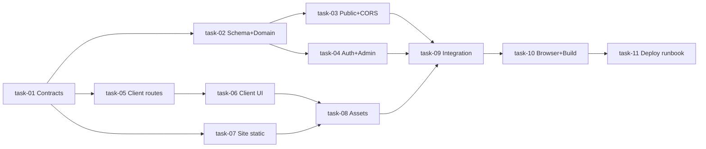

# План: viwa-landing-subscriptions

**sessionId:** `viwa-landing-subscriptions`  
**Дата:** 2026-07-29  
**Основание:** `tz.md` v1, `architecture.md` v1.2, `architecture_review.md` (круг 2 — без критичных)

## Целевые репозитории

| Репо | Рабочая ветка | Команды верификации | Примечание |
|------|---------------|---------------------|------------|
| `viwa-telemetry` | `main` | `npm run lint`, `npm run typecheck`, `npm test`, `npm run build` | Prisma в `apps/api/` |
| `viwa-client-web-app` | `dev` | `npm run lint`, `npm test`, `npm run build`; locale при текстах | `VITE_VIWA_TELEMETRY_API_URL` |
| `viwa-site` | `master` | static validation, `python -m http.server` preview, link/asset checks | без AGENTS.md; Docker **не трогать** |

**Browser testing:** обязателен по ТЗ (B-1…B-18) → `viwa-client-web-app/TEMP_TEST_SCENARIOS.md`.

**Image generation:** выполняет **parent orchestrator** (`GenerateImage`); субагентам **запрещено** генерировать assets. Интеграция — task-08 по manifest §7 architecture.

**Uncommitted work:** в `viwa-telemetry/apps/web/` есть чужие локальные analytics changes — **не откатывать**, не включать случайно в scope других задач; `registrationSource` UI — отдельный slice в task-04.

## Ключевые решения planner

1. **Contract-first + telemetry gate:** client/site **не подключают live public API** до закрытия Wave 1 (task-03 CORS + public tiers/tastes стабильны; task-04 auth/profile).
2. **Canon §0:** `entry=website`, `registrationHint`, `registrationSource` только в response; см. task-01.
3. **Параллелизация:** после Wave 1 — client (task-05/06), site (task-07), parent image gen — **параллельно**; integration — task-09.
4. **Deploy:** task-11 → **`deploy-runbook.md`** (ordering telemetry→client→site, M1 PG dump, S1–S8, rollback, `wiva-server` alias); **commit/push/deploy** — только `/task-completion` после all gates; **production deploy explicitly authorized** пользователем (2026-07-29). **CI monitoring** (`/ci-cd-status`) — только по отдельному запросу.
5. **Mobile landing parity gate:** лендинг обязан быть полноценным на mobile (`360×800`, `390×844`, `430×932`), не desktop-only; owner polish — **task-09**; formal browser gate — **task-10**.
6. **Docker:** все задачи — **запрет** изменений Docker/compose файлов.

## Таблица задач

| ID | Задача | UC | Репо | Зависимости |
|----|--------|-----|------|-------------|
| task-01 | Контракты §0 + public/client/admin REST | UC-3, UC-6, UC-7 | viwa-telemetry | — |
| task-02 | Prisma migration + monthly pool domain + marketing filter + tests T1–T6 | UC-6, UC-5 | viwa-telemetry | task-01 |
| task-03 | Public tiers/tastes + CORS + contracts/tests T1–T3, T8 | UC-1, UC-6 | viwa-telemetry | task-02 |
| task-04 | registrationSource/auth + favorites + admin analytics + tests T9–T11 | UC-3, UC-4, UC-7 | viwa-telemetry | task-02 |
| task-05 | Client serial/no-serial routing + auth attribution + tests | UC-2, UC-3, UC-4 | viwa-client-web-app | task-01; live API → task-03, task-04 |
| task-06 | Client concept-16 UI + monthly progress + favorites/tastes + locale/tests | UC-5, UC-6 | viwa-client-web-app | task-05; live API → task-03, task-04 |
| task-07 | Site one-page concept-16 + API shell + serial capture CTA + static checks | UC-1, UC-2 | viwa-site | task-01; live API → task-03 |
| task-08 | Generated assets integration (manifest external input) | UC-1, UC-5 | viwa-site + viwa-client-web-app | task-06, task-07; **parent assets** |
| task-09 | Cross-repo integration + **mobile landing polish** (live API wire-up) | UC-1…UC-7 | все три | task-03, task-04, task-06, task-07, task-08 |
| task-10 | **Browser gate** B-1…B-18 (mobile parity + desktop) + lint/build/test | B-1…B-18 | все три | task-09 |
| task-11 | Deploy runbooks, smoke S1–S8, ordering (gates only) | UC-8 | docs + all repos | task-10 |

## Волны выполнения

### Волна 0 — Contract-first (gate для реализации)

| Параллельно | Задачи |
|-------------|--------|
| 1 dev | **task-01** |

**Exit criteria:** canon §0 в контрактах; `loyalty-public-rest.md` описывает marketing filter (2 tiers); check-code `registrationHint`; admin `registrationSourceBreakdown`.

---

### Волна 1 — Telemetry foundation (**блокирует live wire-up client/site**)

| Порядок | Задачи |
|---------|--------|
| Sequential | **task-02** |
| Parallel | **task-03** ∥ **task-04** (после task-02) |

**Exit criteria (Wave 1 gate):**

- T1–T3: `listMarketingSubscriptionLevels()` → ровно 2 items, volumes 12000/18000
- T4–T6: monthly pool invariants; legacy MSK reset preserved
- T8: CORS preflight с `Origin: https://vitamin-water.ru` → 204 + Allow-Origin
- T9–T11: auth attribution matrix; `SERIAL_REQUIRED`; existing client immutable
- Staging/local: `GET /api/v1/public/subscription-levels` и `/public/tastes` доступны

**Запрет:** task-05/06/07 **не переключают** `VITE_*` / `landing-api.js` на production public API до этого gate (mocks/fixtures допустимы).

---

### Волна 2 — Parallel surface development

| Параллельно | Задачи | Примечание |
|-------------|--------|------------|
| dev A | **task-05** → **task-06** | mocks после task-01; UI shells параллельно с site |
| dev B | **task-07** | static HTML/CSS/JS; mock tiers в `landing-api.js` |
| parent | **GenerateImage batch** | manifest + files → вход для task-08; **не субагент** |

**Exit criteria:** routes `/register`, `/auth`, `/m/:serial/*`, `/home`; site split/stack layout; CTA URL builder с `entry=website`.

---

### Волна 3 — Integration

| Порядок | Задачи |
|---------|--------|
| Parallel start | **task-08** (когда parent передал manifest + files) |
| After task-08 + Wave 1 gate | **task-09** |

**Exit criteria:** client + site fetch live public API; 14 tastes + 2 tier cards; assets по manifest; Flow A/B/C end-to-end на staging; **mobile landing parity** verified on `360×800`, `390×844`, `430×932` (task-09 owner).

---

### Волна 4 — Verification & deploy prep

| Порядок | Задачи |
|---------|--------|
| Sequential | **task-10** (browser gate) → **task-11** |

**Exit criteria:**

- **task-10 browser gate:** B-1…B-18 на canonical viewports; landing B-1…B-8 **must pass** на всех трёх mobile widths + desktop `1440×900`; documented skips only with reason
- lint/build/test exit 0 во всех репо
- **`deploy-runbook.md`:** ordering telemetry → client → site; smoke S1–S8; M1 PG dump; rollback; gates 36 PASS / 0 FAIL / 2 deferred (B-17/B-18 post-deploy)
- **Deploy не выполняется** в task-10/11 — `/task-completion` после all gates + **user-authorized production deploy**; no CI monitoring unless separately requested

---

## Dependency graph

## Test invariants (architecture § Test invariants)

| ID | Owner task |
|----|------------|
| T1–T3 | task-02, task-03 |
| T4–T6 | task-02 |
| T7 | task-04 |
| T8 | task-03 |
| T9–T11 | task-04 |

## Blocking questions

[] — planner blocking questions отсутствуют; architecture v1.2 blockingQuestions закрыты.
